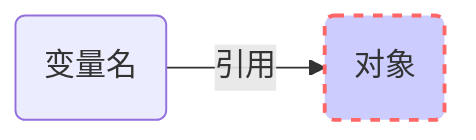
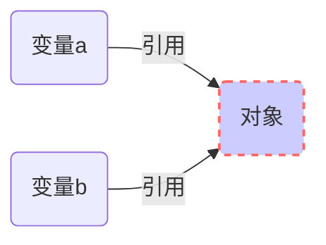

# Python 的动态类型介绍

1.在 Python 中没有变量的声明以及变量的类型：

- 变量的类型实在运行过程中自动决定的，而不是通过声明来决定的
- 变量首次赋值时，创建它。之后的再次赋值会改变该变量的值

  2.类型的概念是存在于对象中而不是变量名中。变量名是通用的，它只是在特定时刻引用某个特定的对象而已。

- 当变量出现在表达式中时，它会马上被当前引用的对象所代替
- 任何变量名在使用前必须明确地赋值。用未赋值的变量会产生错误。

> 在 Python 内部，变量实际上是指向对象内存空间的一个指针

3.每个表达式生成的结果，python 都创建了一个新的对象去表示这个值

4.Python 对象缓存了不变的对象并对其进行复用，如小整数和小字符串。但是逻辑上看，每个表达式的结果值都是不同的对象，占用不同的内存。

5.每个对象都有两个标准的头部信息：

- 类型标志符：标识了该对象的类型（见第 10 条）
- 引用计数器：决定了是否可以回收这个对象（见第 8 条） >引用计数器记录了当前指向该对象的引用的数目。一旦它为 0，
  则该对象的内存空间就会自动回收

  6.给一个变量赋新值，并不是替换原始的对象，而是让这个变量去引用完全不同的一个对象。

  7.多个变量名引用同一个对象时，称为共享引用：

- 在共享引用中，对象的原地修改操作会影响到所有的引用该对象的变量
- 共享引用的多个变量之间，`is`比较的结果为`True` >`==`操作符比较的是两个变量引用的对象是否具有相同的值

      >`is`操作符比较的是两个变量是否引用的是同一个对象

  8.`sys`模块的`getrefcount`函数会返回对象的引用次数，如：  
  

> 这里可以看到 Python 对象缓存了不变的对象并对其进行复用

9.动态类型是 Python 多态的基础，因为没有类型约束。Python 的多态是`x.method`的方法运行时，`method`的意义取决于`x`的类型，**属性总是在运行期解析**。

10.查看对象的类型用`type()`函数，如：  

11.Python 提供了几种方法来查看对象的属性以及详细信息：

- dir(x)：查看 x 所指对象的属性
- help(x.attr)：查看 x 所指对象的 attr 属性
- help(x)：查看 x 所指对象的详细信息  
  

  12.`None`对象是一个特殊的 Python 对象，它总是`False`，一般用于占位。它有一块内存，是一个真正的对象。它不代表未定义，事实上它有定义。

- `None`是所有函数和方法的默认返回值  
  

  13.Python 中，任何东西都是对象类型（见第 10 条），类型本身也是对象类型：

- `type(x)`返回变量`x`指向对象的类型
- `isinstance(x,typename)`用于测试`x`所指对象是否是`typename`类型
- 调用类型名是对这些对象构造函数的调用，而不仅仅是类型转换  
   

  14.基本上在代码中进行类型检查是错误的，着破坏了代码的灵活性，限制了代码的类型。Python 代码不关心特定的数据类型，只关心接口，这就是 Python 的多态设计

- 一个操作的意义取决于被操作对象的类型。同样的操作对不同的对象来说意义可能不同，前提是该对象支持该操作
- 若对象不支持某种操作，则 Python 会在运行时检测到错误并自动抛出一个异常

  15.Python 可以在旧版本中开启新版本的特性，只需用在模块文件中使用：
  `from __future__ import 特性名`
