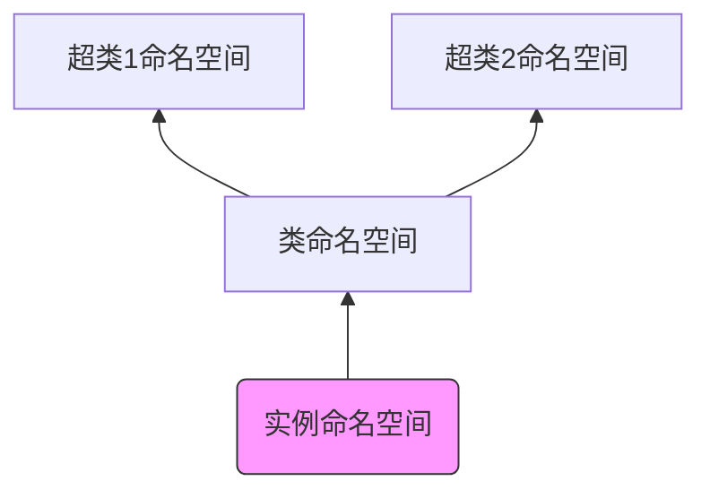

# 类 class

1.Python 中，类`class`与实例`instance`是两种不同的对象类型

- 类对象是实例对象的工厂
- 类对象与实例对象都有各自独立的命名空间
- 类对象来自于类定义语句，实例对象来自于函数调用语句
- 实例对象可自动存取类对象中的变量名

  2.类的定义：

```
  class class_name:
	name1=val
	def method(self):
		pass
```

- `class`语句类似于`def`语句，也是可执行语句。执行时会产生新的类对象，并将该类对象赋值给变量名（即类名）
- `class`语句内的顶层赋值语句会创建类的属性。`class`语句创建的作用域会成为类属性的命名空间
  > 如果是`class`内的`def`中的赋值语句，则并不会创建类的属性
- 类属性为所有的实例对象提供状态和行为，它是由该类创建的所有实例对象共享的

  3.生成实例对象：

```
  instance_name=class_name()
```

- 像函数那样调用类对象会创建新的实例对象。
  - 每次调用时，均会返回新的实例对象
  - 每个实例对象都有自己的命名空间。同一个类的实例对象不一定属性都相同
- 每一个实例对象继承类的属性并创建了自己的命名空间
  - 类创建的实例对象是有新的命名空间。刚开始该命名空间是空的，
    但它会继承创建该实例所属类对象的属性。
  - 继承的意思是，虽然实例对象的命名空间是空的。
    但是名字查找会自动上升到类对象的名字空间去查找
- 在类的`def`中，第一个参数（根据惯例称为`self`）会引用调用该函数的实例对象。对`self`的属性赋值，会创建或修改实例对象的属性，而非类的属性。
  _ 可以通过方法调用： `instance_name.func()`
  _ 也可以通过类调用： `class_name.func(instance_name)`

  

  4.与 C++不同，Python 的`class`语句是一个可执行语句，且是隐式赋值的。

  5.可以在`class`语句外创建类对象的新属性，通过向类对象直接赋值来实现。

```
  classA.attr=val
```

可以在`class`语句外创建实例对象的新属性，通过向实例对象直接赋值来实现。

```
  a=classA()
  a.attr=val
```


6.类可以继承。被继承的类称为超类，继承类称为子类。

```
  class childC (parentC): # childC为子类，parentC为超类
	pass
```

- 类对象会继承其超类对象中定义的所有类属性名称。读属性时，若该属性不存在于本类中，Python 会自动在超类的命名空间中寻找
  > 若是写属性，则会创建新属性（此时仅操作本类的命名空间）
- 实例对象会继承所有可访问到的类的属性。读变量名时，Python 会首先检查实例的命名空间，然后是类的命名空间，最后是沿继承链查找所有超类的命名空间
- 若子类重新定义了超类的变量名（无论是在`class`内部定义，还是在`class`外部通过赋值来定义），子类会取代并定制所继承的行为。这称为重载  
   

  7.类对象的 `.__dict__`属性是类对象的命名空间，是一个类字典对象`mappingproxy`对象 ；
  实例对象的 `.__dict__`属性是实例对象的命名空间，是一个字典；  
  通过查看它们可以轻易地查看到继承树的各属性  
   

  8.实例对象的`.__class__`属性是它所属的类  
  类对象的`__bases__`属性是它超类对象的元组  
  类对象的`__name__`属性是类名  
   

  9.在子类中调用超类的方法：`superClass.func(obj,args)`，其中`obj`通常为`self`  
   

  10.Python 的继承与 C++继承不同。在 Python 中，当对象通过点号运算读取属性值时就会发生继承，而且涉及了搜索属性定义树。

- 每次使用`name.attr`时(`name`为实例对象或者类对象），Python 会从底部向上搜索命名空间树。先从本对象的命名空间开始，一直搜索到第一个找到的`attr`名字就停止
- 命名空间树中较低位置处的定义会覆盖较高位置处的定义
- 继承树的搜索仅仅发生在读取属性值的时候。在写属性值时，执行的是属性的定义（当前命名空间中该名字不存在）或赋值（当前命名空间中该名字已存在）语义。



11.类对象与实例对象都是内存中的临时对象。可以通过对象持久化来把他们保存在磁盘中。

- `pickle`模块：通用的对象序列化与反序列化工具。它可以将任何对象转换为字节串，以及将该字节串在内存中重建为最初的对象。`pickle`常用接口为：

  - 序列化：
    - `pickle.dump(obj, file, protocol=None, *, fix_imports=True) `: 将`obj`对象序列化并写入`file`文件对象中
    - `pickle.dumps(obj, protocol=None, *, fix_imports=True)`：将`obj`对象序列化并返回对应的字节串对象（并不写入文件中）
  - 反序列化：
    - `pickle.load(file, *, fix_imports=True, encoding="ASCII", errors="strict") `：从`file`对象中保存的字节串中读取序列化数据，反序列化为对象
    - `pickle.loads(bytes_object, *, fix_imports=True, encoding="ASCII", errors="strict")` ：从字节串中读取序列化数据，反序列化为对象

  

- `dbm`模块：一个可以通过键访问的文件系统.它的键、值都是字节串或者字符串。它以类似字典的方式访问（但是首先要`open`）。  
   

- `shelve`模块：以上两个模块按照键将 Python 对象存/取到一个文件中。`shelve`模块提供了一个额外的结构层。允许按照键来存储`pickle`处理后的对象

  12.`shelve`模块用法：它用`pickle`把对象转换为字节串，并将其存储在一个`dbm`文件的键之下；它通过键获取`pickle`化的字节串，并用`pickle`在内存中重新创建最初的对象

- 一个`shelve`的`pickle`化对象看上去就像字典。`shelve`自动把字典操作映射到存储|读取在文件中的对象
  > 一个`shelve`和常规字典用法上的唯一区别：
  > 一开始必须打开`shelve`并且在最后关闭它。另外`shelve`不支持`SQL`查询工具
- 存取语法

  - 存储的语法：

        ```
        import shelve

    db=shelve.open('filename') #打开
    for obj in objList:
    db[obj.name]=obj #写入
    db.close() #关闭

    ```

    ```

  - 读取的语法:

    ```
    import shelve
    db=shelve.open('filename') #打开
    for key in db:#像字典一样访问
    print(key,'=>',db[key]) #读取
    db.close() #关闭
    ```

- 载入重建存储的对象时，不必`import`对象所属类。因为 Python 对一个对象进行`pickle`操作时，记录了`self`实例属性，以及实例所属类的名字和类的位置。当`shelve`获取实例对象并对其进行`unpickle`时，Python 会自动重新`import`该类。
- 优缺点：
  _ 缺点：`pickle`作用的类必须在一个模块文件顶部编码，且该模块文件可通过`sys.path`找到
  _ 优点：当类实例对象再次重建时，对类的源代码文件的修改会自动选取。 >这一般发生在两次运行时。若仅仅在一次运行中，则前面已 import，再次 import 无效果

  

  13.类可以有文档字符串。文档字符串是位于各种结构顶部的字符串常量。

- 文档字符串在运行时能保持
- 可以通过`.__doc__`属性获取  
   
